# AWS CI/CD (CodePipeline) 구축


***Base Code**: aws code start sample code*

## 가정사항

- AWS에 대한 기초적인 지식을 가지고 있음
- CI/CD에 대해 기본적인 지식을 가지고 있음
- 리전: Seoul (ap-northeast-2)
- Console 환경: 20/02/13


## 시나리오

- Codecommit(repo), Codebuild(build), Codedeploy(deploy)를 구축하고 Codepipeline으로 automation 구현 


## 준비 사항

### EC2 Installation

#### Option

- AMI: ami-0bea7fd38fabe821a (Amazon Linux 2)
- Type: t2.micro
- VPC: Default VPC
- Subnet: Public Subnet A
- Volume: 8GiB, gp2 (Default)
- Security Group: SSH(22), HTTP(80) {0.0.0.0/0}
- keypair 생성
- Codedeploy Agent 설치 필요

```bash
#user-data로 사용하거나 놓쳤다면 직접 접속해서 설치
sudo yum update -y
sudo yum install -y ruby
sudo yum install -y wget
cd /home/ec2-user
wget https://aws-codedeploy-ap-northeast-2.s3.ap-northeast-2.amazonaws.com/latest/install
chmod +x ./install
sudo ./install auto
```

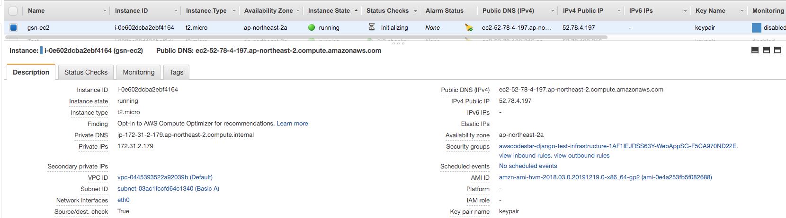

### Create IAM role and Attach EC2

- Name: codedeploy-ec2-role
- Create IAM EC2 Service Role

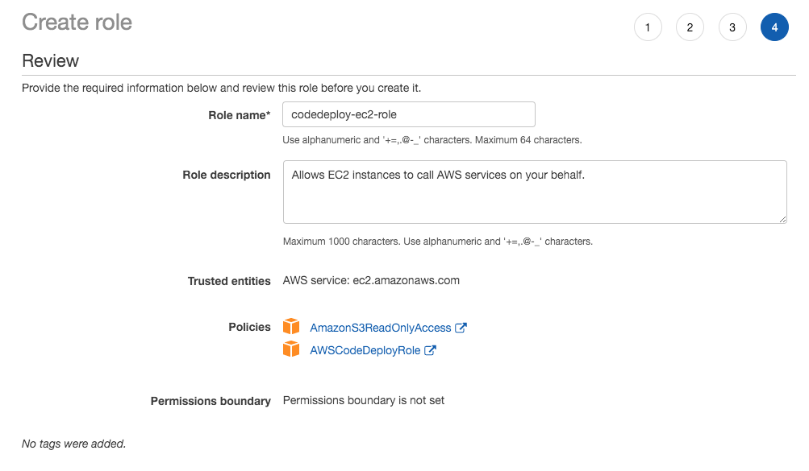

- Attach IAM

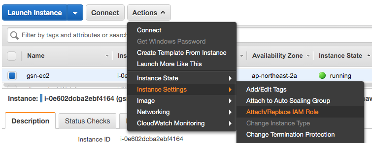

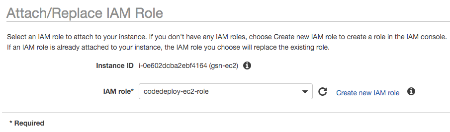

##### 참조

- EC2가 모두 올라간 이후에 접속해서 codedeploy agent가 설치가 되었는지 확인해 보고 설치가 안됬다면 위의 스크립트를 확인하여 설치해야함

```bash
sudo service codedeploy-agent status
```

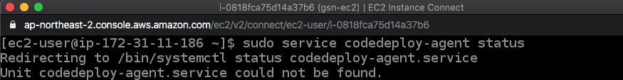

## Create Pipeline

### CodeCommit

#### Create Repository

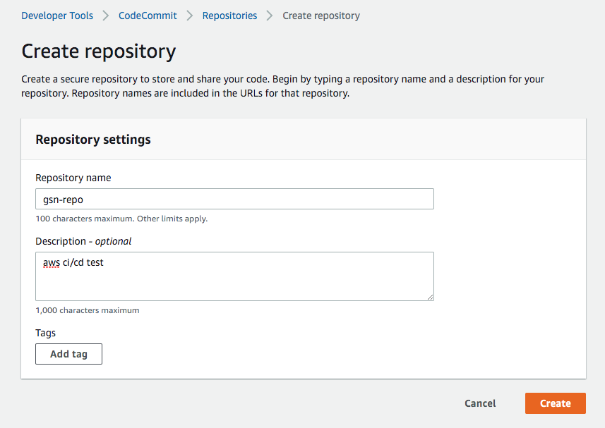


### CodeDeploy

#### Create IAM Role

- Name: codedeploy-role
- Create IAM CodeDeploy Service Role

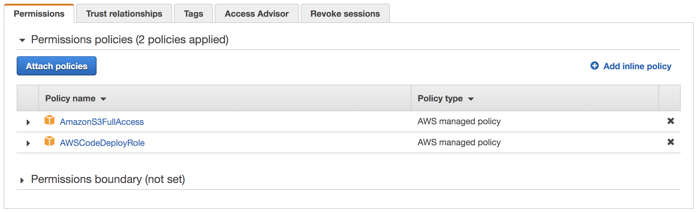


#### Create application

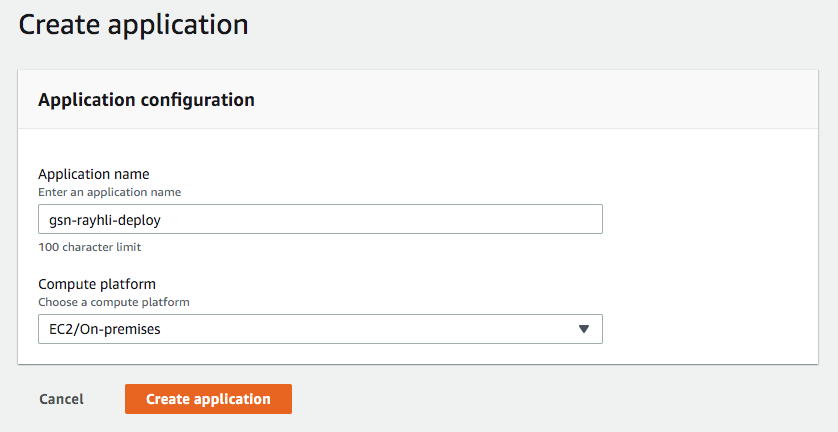

##### 참고

- Compute platform (EC2/On-premises, Lambda, ECS)


#### Create deployment group

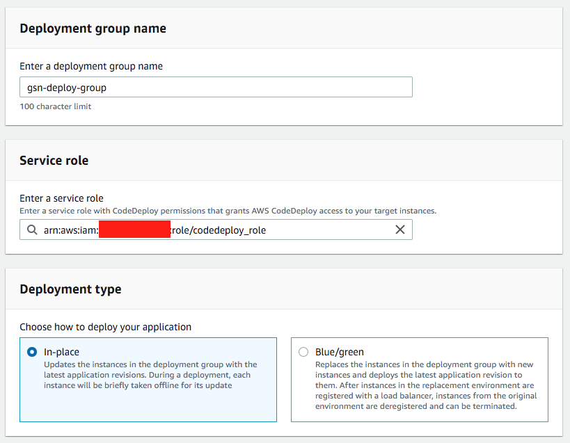

##### 참고

- 서비스 롤은 자동으로 생성해주지 않기 때문에 IAM에서 CodeDeploy Service Role로 생성해야함
- Deployment type (In-pace, Blue/green {AutoScaling Group or Manully provision instance})

#### Environment Configuration

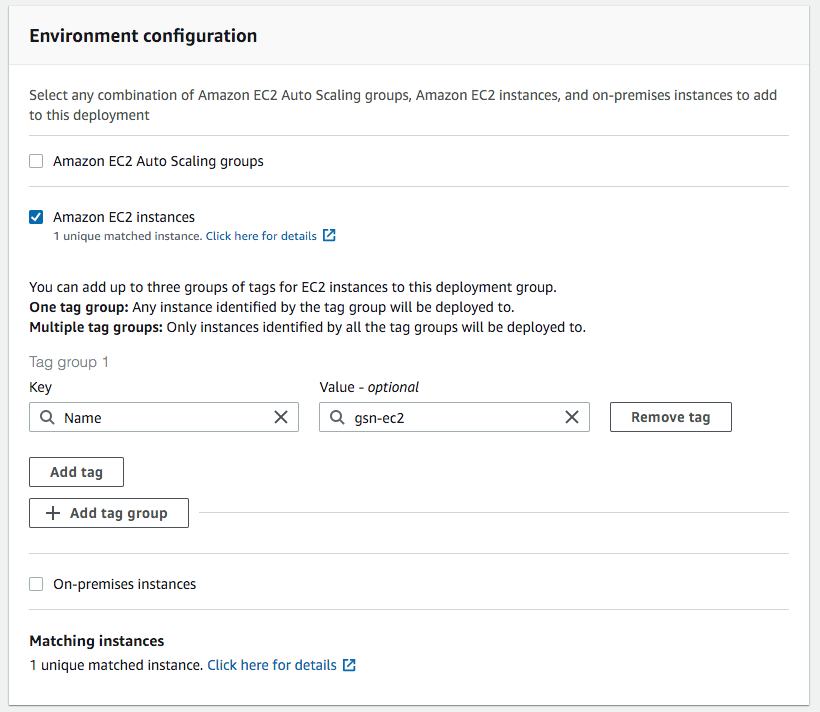

##### 참고

- EC2 tag방식이 제일 빠르며 필터를 진행한 이후 몇개의 인스턴스가 매치되었는지 확인해야함


#### (option-blue/green) Deployment settings

##### 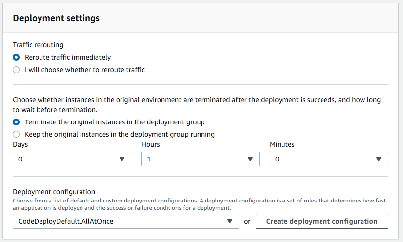


#### Load balancer

- In-place의 경우 안해도 되지만 blue/green에서는 반드시 필요함 (ALB/CLB)

- Load balancer를 사용하는 경우 BlockTraffic에서 로드밸런서의 등록 취소하는 시간으로 인해 지연(Deregistration: 300s)이 발생하며 AllowTraffic의 Default는 Interval Time : 30s, threshold : 5이므로 기본 150s의 지연이 발생

#### Advanced

- Triggers, Alarms, Rollbacks


### Code Pipeline & Codebuild

- 파이프라인 구축 중에 빌드 stage를 생성할 수 있으므로 같이 진행함

#### pipeline setting

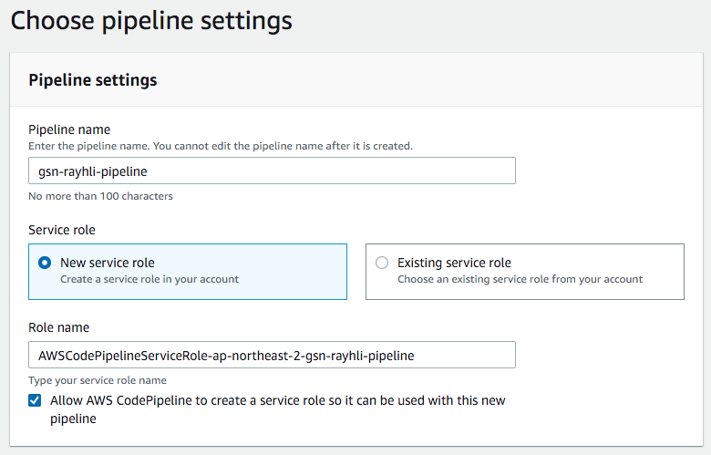

##### 참조

- 서비스가 없는 경우 자동으로 role를 만들어 줌

- Advanced setting은 Default로 진행


#### source stage

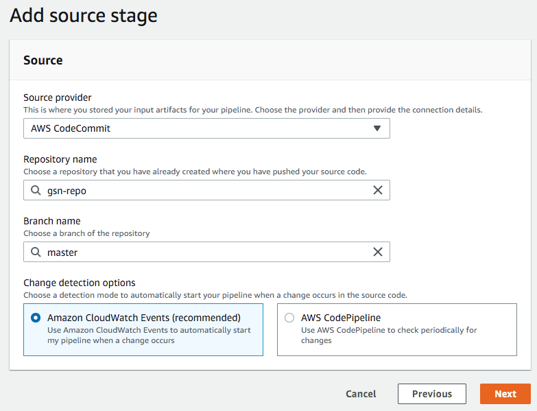

##### 참조

- 처음 만드는 경우 branch가 없기 때문에 master라고 기입하면 됨


#### create build stage

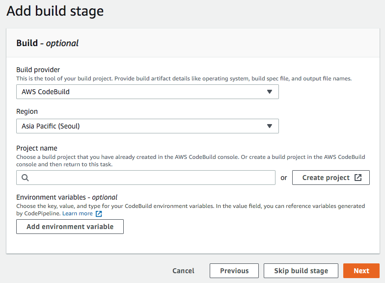


#### create codebuild

##### project configuration


##### 참조

- 프로젝트용으로 생성된 URL을 통해 공개적으로 접근하거나 최신 빌드 상태를 표시하는 내장 이미지를 제공하는 빌드 배지 사용을 지원하나 pipeline 구축시 지원이 제외 됨

##### build environment

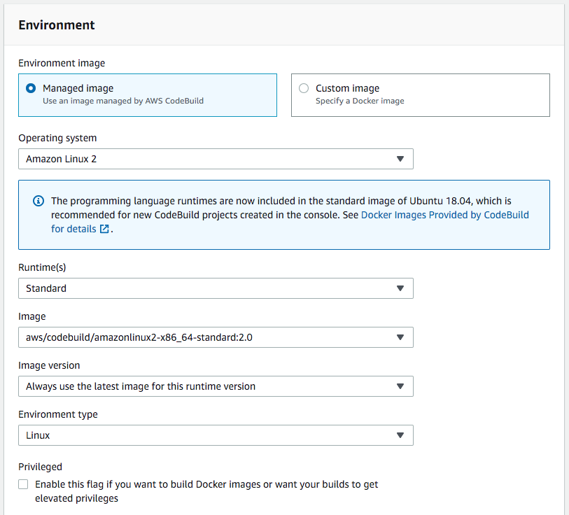

##### 참조

- Environment image : AWS에서 제공하는 이미지를 사용하거나 도커형태로 만든 빌드 서버를 사용할 수 있음

- Operationg system : Amazon Linux 2, Ubuntu

- Environment type : Linux, Linux GPU

- Priviledged : 도커를 빌드할 때 사용하거나 sudo 권한이 필요한 경우

  

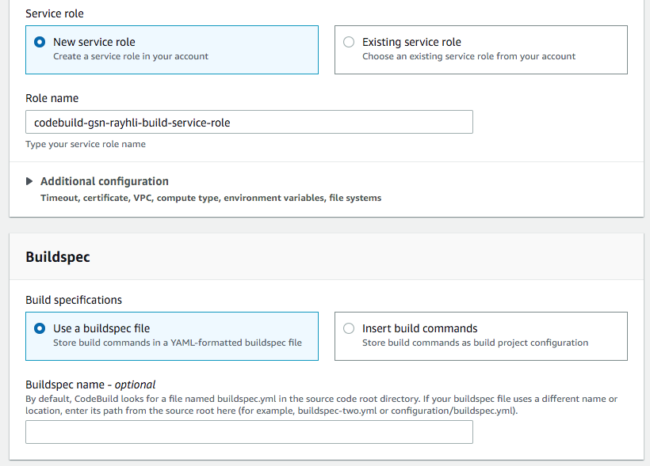

##### 참조

- 빌드 서버를 처음 만드는 경우 build service role이 없는 경우 자동으로 만들어 줌
- Additional configuration
  - Timeout : Defaults는 1시간이며 5분에서 8시간 사이로 셋팅할 수 있음(Default timeout,e Queue timeout)
  - certificate : 자체 서명 인증서 또는 CA에서 발급받은 인증서가 있는 경우 S3버킷에 인증서를 설치
  - VPC : 특정 VPC, Subnet을 지정해야하는 경우 (Security Groups 필수)
  - comput type
  - environment variable : 파라미터 지정 (Plaintext, Parameter, Secrets Manager)
  - File systems : File systems Mount
- Logs는 모두 비활성화

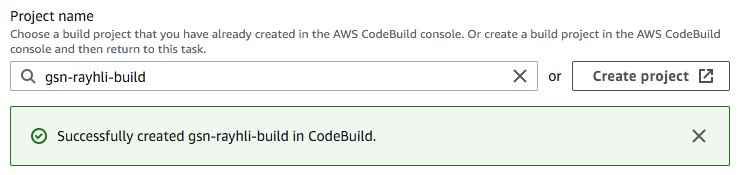

- build stage가 필요 없는 경우 Skip 가능

#### Deploy Stage

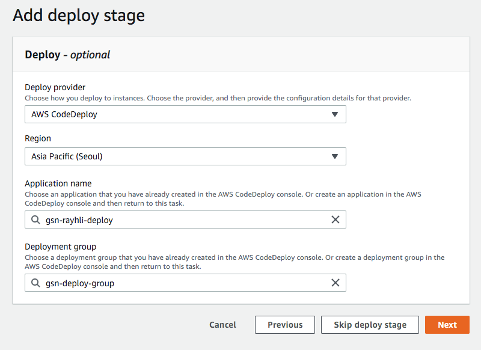


## 생성 완료

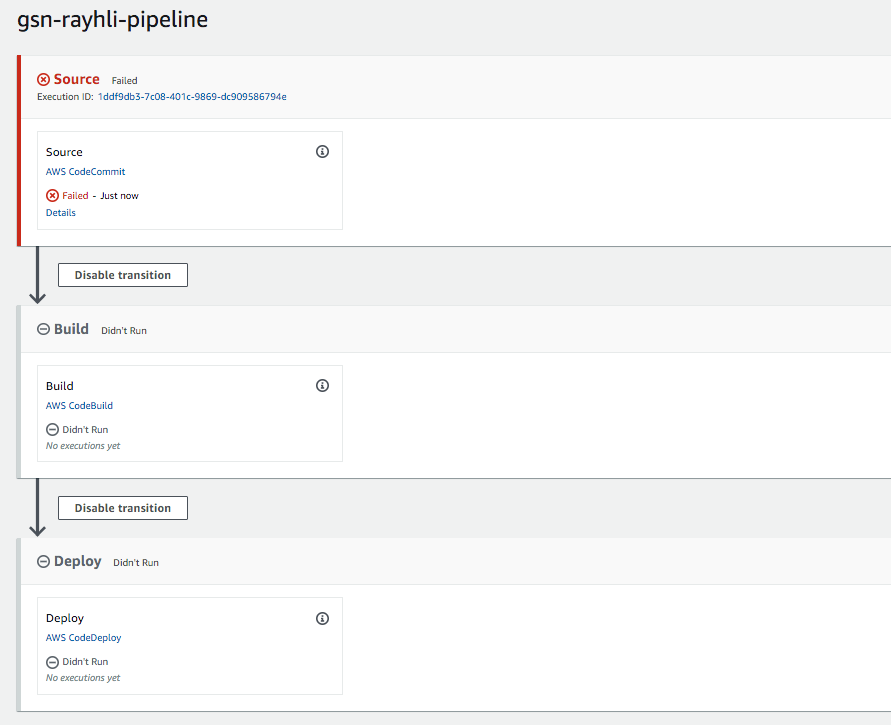

##### 참조

- 현재 repo에 코드가 없어서 파이프라인이 동작하지 않음
- codedeploy의 로그는 /var/log/aws/codedeploy-agent/codedeploy-agent.log에서 확인 가능
- 주의 사항

```reStructuredText
2020-02-14 00:01:11 ERROR [codedeploy-agent(22657)]: InstanceAgent::Plugins::CodeDeployPlugin::CommandPoller: Missing credentials - please check if this instance was star ted with an IAM instance profile
```

다음과 같은 오류가 나오는 경우에는 EC2에 IAM을 제대로 attach했는지 확인해보거나 에이전트를 재동작하는 작업이 필요함

```bash
sudo systemctl restart codedeploy-agent
sudo systemctl status codedeploy-agent
```

