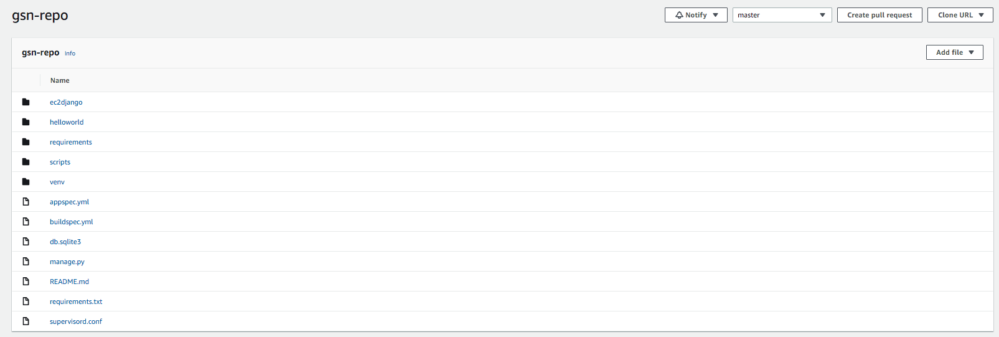
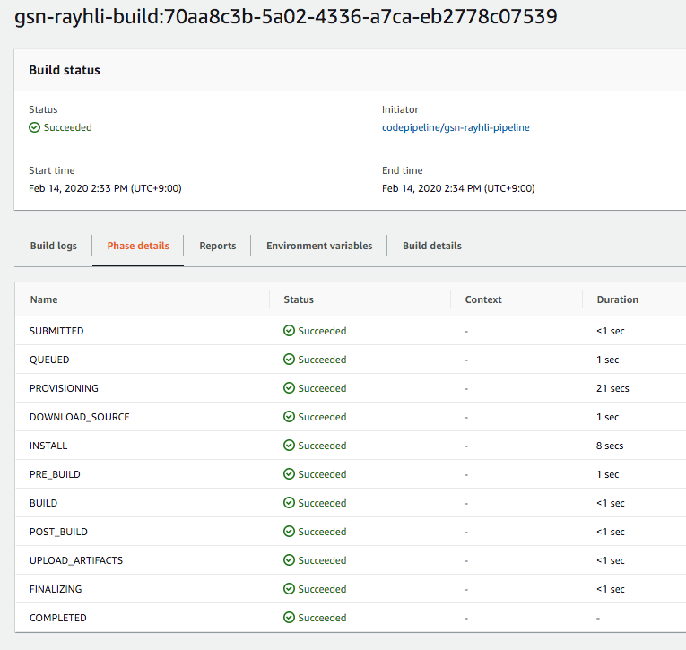
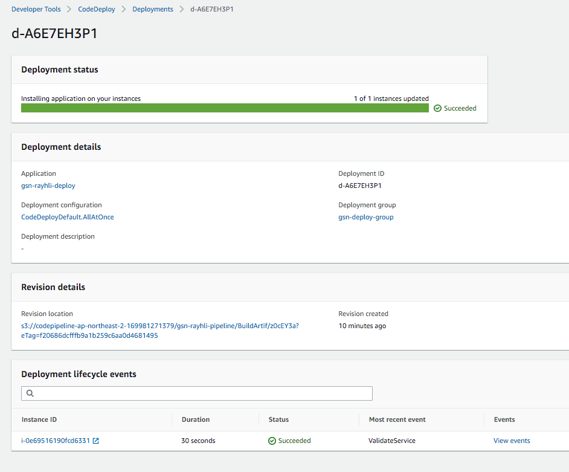
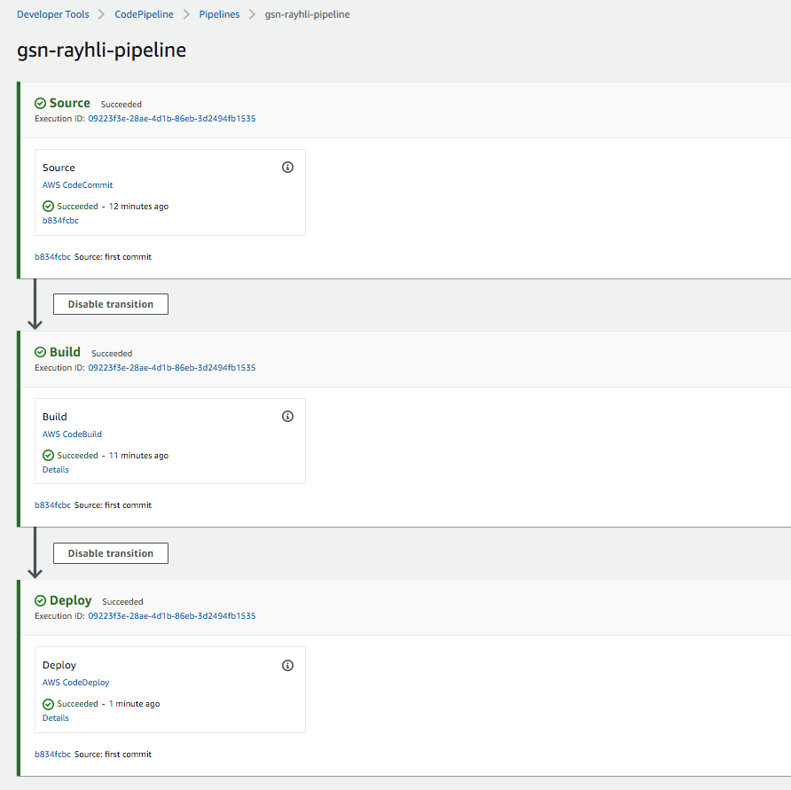
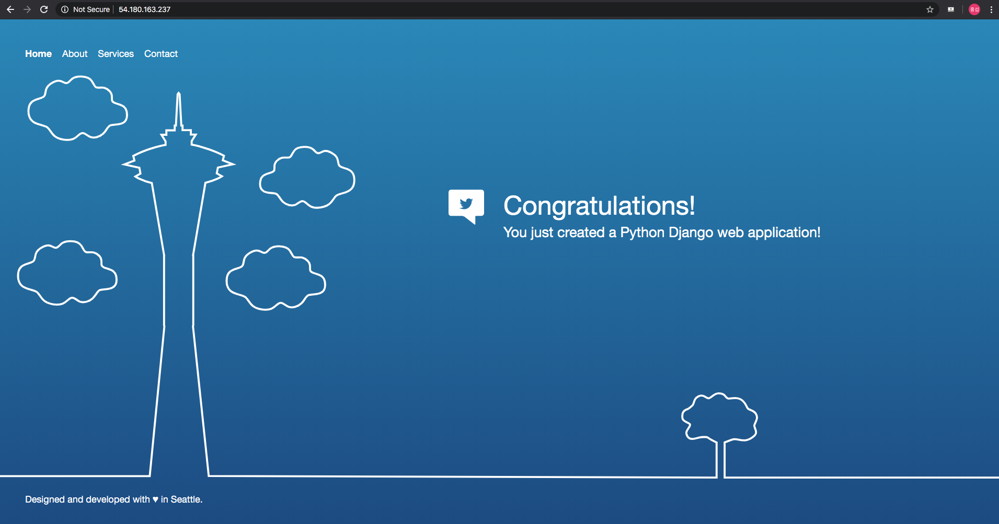

# CI/CD Pipeline Python Django Sample Test


***Base Code**: aws code start sample code*


## 가정사항

- python에 대한 기본적인 지식을 알고 있음
- django framework에 대한 기본적인 지식을 알고 있음
- current version : django == 1.11.28
- IAM User를 소유하고 있고 자격증명을 완료한 상황(aws configure)
- IAM 자격증명이 안되는 경우 codecommit에 대한 credential은 있어야함


## Repository Set

```bash
//Path: gsn-repo/django
git init
git remote add origin <my-repository-address>
//기존에 생성한 codecommit에 주소를 기입
git remote get-url --all origin
```


## Git Commit

```bash
//Path: gsn-repo/django
git add .
git commit -m "first commit"
git push origin master
//codecommit repo에 push
```


## Result



- codecommit repo



- codebuild



- codepipeline



- codepipeline

  

